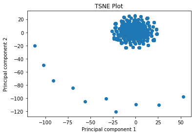
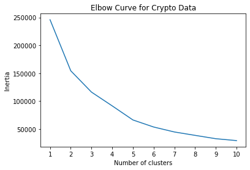
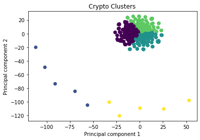

# Unsupervised Machine Learning:   Cryptocurrency Clusters
## Objective
Explore whether the cryptocurrencies on the trading market can be grouped to create a classification system.
## Analysis
1. **Data Preparation**: The dataset, <code>crypto_data.csv</code>, was read into Pandas, cleaned, and standardized. Additionally, all categorical features were converted to numerical data.
2. **Dimensionality Reduction**: The dataset was first reduced with PCA and then further reduced with t-SNE.

3. **Cluster Analysis with k-Means**: An elbow plot was created to identify the best number of clusters.

## Recommendation

Based on the findings, cryptocurrencies can be clustered together. The elbow point in the plot above suggests that the optimal K-value (number of clusters) is 5. The plot below visualizes the clusters.

